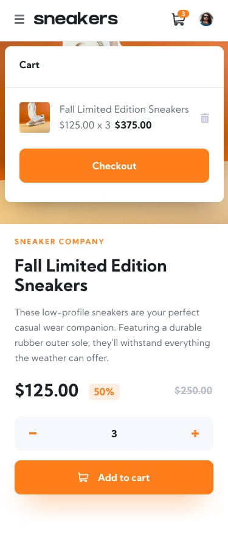

# E-commerce Product Page

This is a challenge from front end monitor to improve my <b>FrontEnd Skills</b>
in this project you'll have one page that represents a single product
under this paragraph you'll find the design that represnts the app

## Getting Started

first clone the repository and then open your terminal and download all the <b>dependencies</b>

```javascript
npm i
```

then run the project by writing in terminal

```javascript
npm run dev
```

<br>

# Desktop Design

<div style="display:flex;gap:10px">


</div>
<br>
<div style="display:flex;gap:10px">


</div>
<br><br>

# Mobile Design

<div style="display:flex;gap:10px">


</div>
<br>
<div style="display:flex;gap:10px">


</div>

